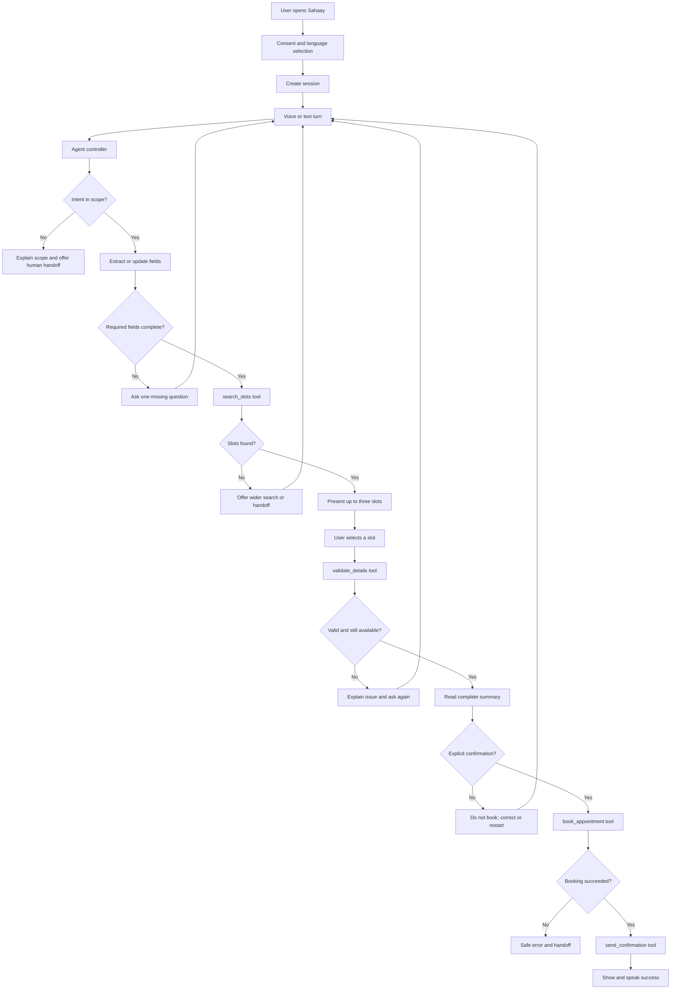

# Sahaay Voice — Agent Workflow and Build Blueprint

## 1. Implementation order

Build in this order so the project always has a testable core:

1. Create the repository skeleton, environment loading, and scripts.
2. Create deterministic appointment fixtures and repository functions.
3. Implement the agent state machine without voice using text input.
4. Add tool schemas, validation, idempotent booking, and audit events.
5. Add automated conversation tests.
6. Add the accessible web interface and operator panel.
7. Connect the OpenAI voice model using the existing controller/tools.
8. Add a text/mock fallback and demo seed/reset controls.
9. Run the accessibility, safety, and live-demo checklist.

Do not start by tuning prompts or visual polish before the deterministic booking path exists.

## 2. System flow



## 3. Agent state machine

### States

| State | Purpose | Allowed transition |
|---|---|---|
| `WELCOME` | Explain AI, obtain consent, choose language | `COLLECT` or `HANDOFF` |
| `COLLECT` | Gather required fields one at a time | `COLLECT`, `SEARCH`, `HANDOFF` |
| `SEARCH` | Query appointment repository | `PRESENT_OPTIONS`, `COLLECT`, `HANDOFF` |
| `PRESENT_OPTIONS` | Present no more than three available slots | `SELECT_SLOT`, `SEARCH`, `COLLECT` |
| `SELECT_SLOT` | Interpret and validate the user's chosen option | `CONFIRM`, `PRESENT_OPTIONS`, `HANDOFF` |
| `CONFIRM` | Read full details and get explicit yes/no | `BOOKING`, `COLLECT`, `PRESENT_OPTIONS`, `HANDOFF` |
| `BOOKING` | Execute one idempotent booking | `NOTIFY`, `HANDOFF` |
| `NOTIFY` | Simulate/send confirmation | `COMPLETE`, `HANDOFF` |
| `COMPLETE` | Provide reference and close or start another request | `COMPLETE`, `WELCOME` |
| `HANDOFF` | Package context for a human | terminal for current request |
| `ERROR` | Recover from unexpected failure | `COLLECT`, `HANDOFF` |

### State invariants

- No tool may run from an invalid state.
- `book_appointment` is callable only from `BOOKING` after `CONFIRMATION_ACCEPTED`.
- A state transition must be written to the audit log.
- Every user-visible failure must have a recovery action or handoff option.
- A session may have at most one successful booking for a given idempotency key.

## 4. Turn-processing workflow

For every user turn, the controller should execute this sequence:

```text
1. Receive audio/text and session ID.
2. Append the user turn to the transcript.
3. Detect interruption, end-session, language switch, repeat, or handoff first.
4. Load current state and fields.
5. Ask the model to classify intent and extract only relevant fields.
6. Validate extracted values in application code.
7. Decide the next state using deterministic controller logic.
8. If a tool is needed, call the tool and validate its response.
9. Append tool events and state transition to the audit log.
10. Generate a short spoken response and matching UI event.
11. Save session state.
```

The model may suggest the next action, but the controller must enforce the state machine and invariants.

## 5. Voice behavior rules

### Opening

The assistant should say, in the selected language:

> “Hello. I am Sahaay, an AI assistant. I can help you find and book a clinic appointment. I cannot give medical advice. Would you like to continue?”

Do not use a long introduction.

### Asking questions

Ask one question at a time:

1. “What kind of appointment do you need?”
2. “Which town or clinic is easiest for you?”
3. “Which day would you prefer?”
4. “What is your full name?”
5. “What phone number should receive the confirmation?”

If the response contains multiple answers, extract them all and ask only for fields still missing.

### Confirmation

Use a fixed template, not improvised wording:

> “Please check these details. Name: [name]. Service: [service]. Clinic: [clinic]. Date: [date]. Time: [time]. We will send the confirmation to [masked number]. Should I book this appointment? Please say yes or no.”

Accept positive confirmation only when it is unambiguous in the selected language. Otherwise ask again.

### Uncertainty

Use a repair loop:

```text
First uncertainty: repeat the interpreted value and ask for correction.
Second uncertainty: offer a simpler choice or keypad/text option.
Third uncertainty: create a human handoff.
```

Never silently select a date, clinic, or appointment slot.

### Out-of-scope requests

For “What medicine should I take?” or similar:

> “I cannot give medical advice. I can help you book an appointment with a healthcare professional, or connect you to a person.”

For an emergency statement:

> “This service is not for emergencies. Please contact your local emergency service now. I can also connect you to a human if available.”

## 6. Tool execution contracts

### `search_slots`

Input:

```json
{
  "service": "general checkup",
  "location": "North clinic",
  "date_from": "2026-08-20",
  "date_to": "2026-08-27"
}
```

Output:

```json
{
  "ok": true,
  "slots": [
    {
      "slot_id": "slot_001",
      "clinic": "North Public Clinic",
      "service": "General checkup",
      "date": "2026-08-22",
      "time": "10:30",
      "accessibility_note": "Ground-floor entrance"
    }
  ]
}
```

The tool must return an empty list rather than invented alternatives when no slot matches.

### `validate_details`

Validate required fields, date format, phone normalization, service/clinic membership, and current slot availability. Return field-level errors suitable for a follow-up question.

### `book_appointment`

Input must include `session_id`, an `idempotency_key`, and validated details. The repository must atomically check availability and mark the slot booked. Return a fictional reference such as `SAH-2026-0017`.

### `send_confirmation`

In demo mode, write the notification to the session event log and show it in the UI. If an SMS provider is later added, keep it behind the same interface.

### `create_handoff`

Include:

```json
{
  "session_id": "session_123",
  "reason": "low_confidence_date",
  "language": "en",
  "current_state": "COLLECT",
  "collected_fields": {},
  "transcript": [],
  "unresolved_question": "Which date did the user mean?"
}
```

## 7. Prompt design

Keep the system prompt short, versioned, and tested. It should define:

- Identity: Sahaay administrative access assistant
- Scope: appointment discovery/booking only
- No diagnosis, prescriptions, or emergency handling
- One question at a time and plain language
- Explicit confirmation requirement
- Available tools and when each is allowed
- Language persistence and accessibility behavior
- Repair loop and handoff rules

Do not put the entire appointment dataset or long policies in the prompt. Keep those in application code and tool responses.

## 8. Frontend event model

The UI should render a small set of typed events:

```text
session_started
agent_state_changed
transcript_user
transcript_agent
field_updated
tool_started
tool_completed
confirmation_requested
booking_completed
handoff_created
session_error
```

The operator panel should be a projection of these events, not a second source of truth.

## 9. Test workflow

### Unit tests

- Date parsing and ambiguity detection
- Phone normalization
- Required-field validation
- Slot search filtering
- Idempotent booking
- Tool error mapping
- State transition guards

### Conversation tests

Run deterministic transcripts for:

1. Successful booking
2. Missing name
3. Ambiguous date
4. Unavailable slot
5. User rejects confirmation
6. Duplicate confirmation
7. Unsupported language
8. Medical-advice request
9. Emergency request
10. Tool timeout
11. User requests human
12. User asks to repeat or slow down

Each test should assert final state, tool calls, number of bookings, confirmation event, and handoff event where relevant.

### Manual accessibility tests

- Keyboard-only navigation
- Screen reader or no-screen completion
- 200% browser zoom
- High-contrast mode
- Slow/unclear speech
- Background noise
- Language switch during a session
- Text fallback when microphone permission is denied

## 10. Live demo script

### Demo A: successful access

1. Select the second language.
2. Say the appointment request naturally.
3. Give an incomplete date and show the clarification.
4. Select an available slot.
5. Confirm the read-back.
6. Show the booking reference and simulated SMS.
7. Show the operator transcript and audit trail.

### Demo B: safe failure

1. Request an unavailable time.
2. Say an ambiguous date twice.
3. Let the system create a handoff.
4. Show that no appointment was booked.
5. Show the operator the unresolved question and transcript.

Judges should see both usefulness and restraint. The system should be impressive because it completes a real workflow safely, not because it talks endlessly.

## 11. Credit-conscious development

Use text/mock mode for most development. Reserve live voice credits for:

- End-to-end microphone testing
- Interruption/turn-taking tests
- Language and accent checks
- Final demo rehearsal

Keep sessions short, avoid replaying full transcripts unnecessarily, use local fixtures, and close sessions after each test. Record token/credit usage per scenario in a small developer log.

## 12. Coding-agent handoff checklist

Before declaring implementation complete, the coding agent must:

- Read `REQUIREMENTS.md` and `WORKFLOW.md`.
- Explain the chosen stack and any deviations.
- Implement the deterministic workflow before voice integration.
- Add `.env.example` and ensure secrets are ignored.
- Add fixtures and automated tests for the critical invariants.
- Verify explicit confirmation gates `book_appointment`.
- Verify duplicate booking protection.
- Verify handoff preserves context.
- Run the app locally and execute both live-demo scenarios.
- Report what is mocked versus connected to an external service.

